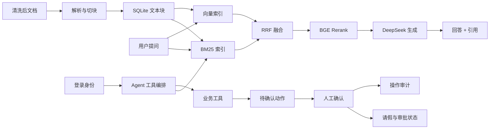

# 企业知识增强 Agent

一个面向中小企业的知识增强业务 Agent。系统既支持基于 RAG 的制度、产品资料和技术文档问答，也支持员工以自然语言查询年假、提交申请、主管审批和管理员重置演示数据。

本项目同时作为个人求职作品，覆盖数据管道、混合检索、生成、文档管理、登录身份、权限过滤、function calling、多步任务、人工确认、业务状态流转、操作审计、前端界面、自动化测试和评测体系。

## 项目亮点

- RAG 全链路：数据导入、切块、混合检索、Rerank、生成、引用与拒答。
- 检索效果可量化：50 道评测题 Hit@5 从 BM25 的 82% 提升到 BGE Rerank 后的 90%。
- 角色权限过滤：员工只能检索“全员”文档，管理员可检索全部文档。
- 自动化测试：33 个 pytest 用例覆盖 V1 问答/文档链路与 V2 登录、权限、审批、多轮修订、并发幂等、审计和重置。
- 中英双语文档：支持中文问题检索英文技术文档。
- 本地可运行：不依赖 Docker 和 GPU，首次运行自动下载模型缓存。
- V2 业务 Agent：DeepSeek function calling、9 个业务工具、多步任务、草稿修订、写操作人工确认和操作审计。
- Agent 真实评测：25 条任务级场景全部通过，覆盖查询、检索、申请、审批和越权拦截。

## 评测结果

| 方案 | 整体 Hit@5 | 制度类 | 产品类 | 技术类 |
| --- | --- | --- | --- | --- |
| BM25 | 82.0% | 100% | 93.8% | 50.0% |
| BM25 + 向量混合 | 86.0% | 94.4% | 100% | 62.5% |
| 混合 + BGE Rerank | 90.0% | 100% | 100% | 68.8% |
| Agent 任务评测 | 100.0%（25/25） | - | - | - |

评测题目和脚本位于 `backend/eval`，报告见 `report_bm25.md`、`report_hybrid.md` 与 `agent_report.md`。

## 系统架构



## 技术栈

| 模块 | 技术 |
| --- | --- |
| 后端 | FastAPI、SQLAlchemy、SQLite |
| 身份认证 | PBKDF2 密码哈希、Bearer Token、持久化会话 |
| 检索 | jieba 分词、BM25、fastembed 向量、BGE Rerank ONNX |
| 模型 | DeepSeek chat API |
| 前端 | React、Vite、TypeScript、Ant Design |
| 测试 | pytest、httpx |

## 项目结构

```text
.
├── backend/
│   ├── app/
│   │   ├── main.py            # 应用入口与问答接口
│   │   ├── config.py          # 环境变量配置
│   │   ├── database.py        # SQLite 连接
│   │   ├── models.py          # 数据表定义
│   │   ├── ingest.py          # 数据导入与切块
│   │   ├── retrieval.py       # BM25 + 向量 + Rerank 检索
│   │   ├── reranker.py        # BGE Rerank
│   │   ├── llm.py             # DeepSeek 调用
│   │   ├── documents_api.py   # 文档管理接口
│   │   ├── auth.py            # 登录、密码和会话
│   │   ├── auth_api.py        # 登录接口
│   │   ├── agent_api.py       # V2 Agent 接口
│   │   ├── agent_tools.py     # 业务工具与权限规则
│   │   ├── agent_service.py   # Agent 主循环与人工确认
│   │   ├── agent_audit.py     # 操作审计
│   │   ├── interview_data_import.py # 模拟数据导入
│   │   └── schemas.py         # 接口数据结构
│   ├── eval/                  # 评测题目、脚本、报告
│   ├── tests/                 # pytest 测试
│   ├── requirements.txt
│   └── .env.example
├── frontend/
│   └── src/
│       ├── pages/ChatPage.tsx       # V1 问答页
│       ├── pages/LoginPage.tsx      # 登录页
│       ├── pages/AgentPage.tsx      # 业务助手
│       ├── pages/TasksPage.tsx      # 我的申请与待审批
│       ├── pages/AuditPage.tsx      # 操作记录
│       ├── pages/DocumentsPage.tsx  # 文档管理页
│       └── api.ts                   # 后端 API 封装
├── data/
│   ├── clean/                 # 233 份清洗后文档
│   └── meta/                  # 元数据、来源说明、清洗日志
└── scripts/                   # 数据准备脚本
```

## 快速开始

### 环境要求

- Python 3.12+
- Node.js 18+
- DeepSeek API Key

### 1. 启动后端

在项目根目录创建并激活虚拟环境：

```bash
python -m venv .venv
.venv\Scripts\Activate.ps1
```

安装依赖：

```bash
pip install -r backend/requirements.txt
```

配置环境变量：

```bash
copy backend\.env.example backend\.env
```

然后编辑 `backend\.env`，填入 `DEEPSEEK_API_KEY`。

导入内置数据：

```bash
cd backend
python -m app.ingest
```

启动后端：

```bash
uvicorn app.main:app --reload --port 8000
```

首次启动会自动下载向量模型和 BGE Rerank 模型，之后会使用本地缓存。接口文档地址：`http://127.0.0.1:8000/docs`

### 2. 启动前端

```bash
cd frontend
npm install
npm run dev
```

访问地址：`http://localhost:5173/`

前端开发服务器会把 `/api` 请求代理到 `http://127.0.0.1:8000`。

## 效果演示

启动后可以在问答页尝试：

- “年假怎么休”
- “API 网关限流怎么配置”
- “Docker 容器是什么”

权限演示：

- 以“员工”角色提问“公司账号密码长度至少需要多少位？”，不会返回管理员权限的《信息安全管理办法》。
- 切换到“管理员”后再问同一问题，可以正常返回该文档。

## 业务助手（V2）

V2 在保留 `/api/chat` 和文档管理链路的基础上独立新增 `/api/agent/*`，使用以下后端真实执行工具：

- `query_leave_balance`：查询员工年假余额。
- `query_my_leave_requests`：只查询当前员工自己的请假申请。
- `query_pending_approvals`：主管查询待自己审批的申请。
- `query_pending_actions`：查询当前员工尚未确认的写操作草稿。
- `revise_leave_request_draft`：修改尚未确认的请假草稿，复用原动作编号。
- `approve_leave_request`：生成批准申请的待确认动作。
- `reject_leave_request`：生成拒绝申请的待确认动作。
- `search_knowledge`：复用 V1 混合检索链路，回答知识库问题并保留引用。
- `submit_leave_request`：生成年假申请待确认动作，确认前不写业务库。

Agent 主循环最多 6 轮工具调用。模拟数据包含 20 名员工、20 条 2026 年年假余额和 7 条请假申请。数据经过校验后按版本一次性导入，后续启动不会覆盖用户产生的业务数据。

V2 接口使用 Bearer Token。演示账号如下，密码均为 `Demo@123`：

| 用户名 | 身份 | 用途 |
| --- | --- | --- |
| `zhangsan` | E001 张三，普通员工 | 发起请假、查看自己的申请 |
| `liming` | M001 李明，部门主管 | 审批下属申请 |
| `zhouzong` | G001 周总，总经理 | 审批主管和管理员申请 |
| `admin` | A001 王敏，管理员 | 管理权限测试 |

主管和管理员也可以发起自己的请假，审批人由系统指定为总经理。总经理不能审批自己的申请。

手动重新导入：

```bash
cd backend
python -m app.interview_data_import
```

登录后进入“业务助手”，系统自动使用当前登录身份：

- “我的年假余额还有多少？”
- “年假申请需要提前几个工作日？”
- “帮我申请 9 月 14 日当天 1 天年假，事由是家中有事。”

涉及请假申请时，界面会显示确认卡片。点击“确认提交”后才会创建待审批记录，主管批准后才扣减余额。主管和管理员也可以发起自己的请假，审批人由系统指定为总经理，不能自审。

左侧“任务中心”提供“我的申请”和“待我审批”两个视图。主管可以查看待办，批准或拒绝申请，并在二次确认后真实更新审批状态。

支持多轮任务修订：例如先申请 1 天年假，再补充“改成 2 天”，Agent 会复用原待确认动作并更新参数，不会创建第二条草稿。并发确认同一动作时，只有一次执行会成功。

左侧“操作记录”展示写操作从创建、确认到执行完成或失败的时间线。普通员工只能查看自己的记录，管理员可以查看全部记录。

管理员登录后，顶部会显示“重置演示数据”按钮。重置会恢复 20 名员工、20 条余额和 7 条基础申请，并清空运行过程中产生的动作和事件。

## Agent 评测

`backend/eval/agent_questions.json` 内置 25 条任务级场景，覆盖余额查询、知识检索、提交请假、审批、越权请求和复合任务。当前真实模型评测通过率 25/25，报告见 `agent_report.md`。执行：

```bash
cd backend
python -m eval.run_agent_eval
python -m eval.run_agent_eval --limit 3
```

## 接口一览

| 方法 | 路径 | 说明 |
| --- | --- | --- |
| GET | /health | 健康检查 |
| POST | /api/auth/login | 登录并获取 Bearer Token |
| GET | /api/auth/me | 获取当前登录用户 |
| POST | /api/auth/logout | 退出并撤销 Token |
| POST | /api/chat | 问答，返回答案和引用 |
| GET | /api/documents | 文档列表 |
| POST | /api/documents/upload | 上传文档 |
| DELETE | /api/documents/{doc_id} | 删除文档 |
| POST | /api/documents/reindex | 重建检索索引 |
| GET | /api/stats | 统计数据 |
| POST | /api/agent/chat | 业务 Agent 对话，返回回答、引用与待确认动作 |
| GET | /api/agent/employees | 获取业务 Agent 可选择的员工列表 |
| GET | /api/agent/leave-requests | 查询当前员工自己的请假申请 |
| GET | /api/agent/approvals | 查询当前主管的待审批申请 |
| POST | /api/agent/leave-requests/{request_id}/approve | 准备批准动作 |
| POST | /api/agent/leave-requests/{request_id}/reject | 准备拒绝动作 |
| GET | /api/agent/actions | 查询当前身份可见的操作记录 |
| GET | /api/agent/actions/{action_id} | 查询操作详情和事件时间线 |
| POST | /api/agent/actions/{action_id}/confirm | 确认写操作并落库 |
| DELETE | /api/agent/actions/{action_id} | 取消待确认动作 |
| POST | /api/agent/demo/reset | 管理员重置演示数据 |

`/api/chat` 请求体：

```json
{
  "question": "年假怎么休",
  "role": "employee"
}
```

`/api/agent/chat` 请求体：

```json
{
  "message": "帮我提交 9 月 14 日当天 1 天年假申请，事由是家中有事",
  "session_id": null
}
```

V2 接口通过 `Authorization: Bearer <token>` 识别当前员工。写操作返回 `pending_action.action_id`，前端通过确认接口提交后才真正入库。

## 测试

```bash
cd backend
python -m pytest -q
```

测试使用独立的临时数据库，不会影响本地 `knowledge.db`。

## 评测

```bash
cd backend
python -m eval.run_eval bm25
python -m eval.run_eval hybrid
```

## 数据说明

- 数据位于 `data/clean`，共 233 份，其中制度类 30 份、产品资料类 25 份、技术文档类 178 份。
- 制度类和产品资料为“云启科技”模拟文档，仅用于学习演示。
- 技术文档来自 FastAPI、Docker、Redis、PostgreSQL、LangChain 等开源项目官方文档，保留原始来源和许可证说明。
- 详细来源见 `data/meta/sources.md` 和 `data/meta/cleaning_log.md`。

## 后续规划

- PostgreSQL + pgvector。
- 更细粒度的部门权限。
- 评测集扩充与指标报表。
- Docker Compose 一键部署。

## 常见问题

- 问答接口返回 503：`backend/.env` 中未配置 `DEEPSEEK_API_KEY`。
- 端口被占用：后端可改用 `--port 8001`，前端代理目标需要同步修改 `frontend/vite.config.ts`。
- 文档重新导入：在 `backend` 目录执行 `python -m app.ingest`，脚本可重复运行。
