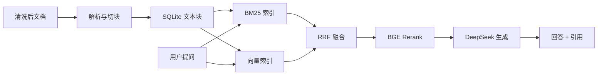

# 企业智能知识库问答系统

一个面向中小企业的知识库问答系统，帮助员工通过自然语言查询制度、产品资料和技术文档。项目基于 RAG 思路实现，检索链路包含 BM25 关键词检索、本地向量检索和 BGE Rerank 精排，由 DeepSeek 生成带来源引用的回答，无法回答时明确拒答。

本项目同时作为个人求职作品，覆盖数据管道、检索、生成、文档管理、权限过滤、前端界面、自动化测试和评测体系。

## 项目亮点

- RAG 全链路：数据导入、切块、混合检索、Rerank、生成、引用与拒答。
- 检索效果可量化：50 道评测题 Hit@5 从 BM25 的 82% 提升到 BGE Rerank 后的 90%。
- 角色权限过滤：员工只能检索“全员”文档，管理员可检索全部文档。
- 自动化测试：10 个 pytest 用例覆盖问答、上传、删除、重建索引和权限。
- 中英双语文档：支持中文问题检索英文技术文档。
- 本地可运行：不依赖 Docker 和 GPU，首次运行自动下载模型缓存。

## 评测结果

| 方案 | 整体 Hit@5 | 制度类 | 产品类 | 技术类 |
| --- | --- | --- | --- | --- |
| BM25 | 82.0% | 100% | 93.8% | 50.0% |
| BM25 + 向量混合 | 86.0% | 94.4% | 100% | 62.5% |
| 混合 + BGE Rerank | 90.0% | 100% | 100% | 68.8% |

评测题目和脚本位于 `backend/eval`，报告见 `report_bm25.md` 与 `report_hybrid.md`。

## 系统架构



## 技术栈

| 模块 | 技术 |
| --- | --- |
| 后端 | FastAPI、SQLAlchemy、SQLite |
| 检索 | jieba 分词、BM25、fastembed 向量、BGE Rerank ONNX |
| 模型 | DeepSeek chat API |
| 前端 | React、Vite、TypeScript、Ant Design |
| 测试 | pytest、httpx |

## 项目结构

```text
.
├── backend/
│   ├── app/
│   │   ├── main.py            # 应用入口与问答接口
│   │   ├── config.py          # 环境变量配置
│   │   ├── database.py        # SQLite 连接
│   │   ├── models.py          # 数据表定义
│   │   ├── ingest.py          # 数据导入与切块
│   │   ├── retrieval.py       # BM25 + 向量 + Rerank 检索
│   │   ├── reranker.py        # BGE Rerank
│   │   ├── llm.py             # DeepSeek 调用
│   │   ├── documents_api.py   # 文档管理接口
│   │   └── schemas.py         # 接口数据结构
│   ├── eval/                  # 评测题目、脚本、报告
│   ├── tests/                 # pytest 测试
│   ├── requirements.txt
│   └── .env.example
├── frontend/
│   └── src/
│       ├── pages/ChatPage.tsx       # 问答页，含角色切换
│       ├── pages/DocumentsPage.tsx  # 文档管理页
│       └── api.ts                   # 后端 API 封装
├── data/
│   ├── clean/                 # 233 份清洗后文档
│   └── meta/                  # 元数据、来源说明、清洗日志
└── scripts/                   # 数据准备脚本
```

## 快速开始

### 环境要求

- Python 3.12+
- Node.js 18+
- DeepSeek API Key

### 1. 启动后端

在项目根目录创建并激活虚拟环境：

```bash
python -m venv .venv
.venv\Scripts\Activate.ps1
```

安装依赖：

```bash
pip install -r backend/requirements.txt
```

配置环境变量：

```bash
copy backend\.env.example backend\.env
```

然后编辑 `backend\.env`，填入 `DEEPSEEK_API_KEY`。

导入内置数据：

```bash
cd backend
python -m app.ingest
```

启动后端：

```bash
uvicorn app.main:app --reload --port 8000
```

首次启动会自动下载向量模型和 BGE Rerank 模型，之后会使用本地缓存。接口文档地址：`http://127.0.0.1:8000/docs`

### 2. 启动前端

```bash
cd frontend
npm install
npm run dev
```

访问地址：`http://localhost:5173/`

前端开发服务器会把 `/api` 请求代理到 `http://127.0.0.1:8000`。

## 效果演示

启动后可以在问答页尝试：

- “年假怎么休”
- “API 网关限流怎么配置”
- “Docker 容器是什么”

权限演示：

- 以“员工”角色提问“公司账号密码长度至少需要多少位？”，不会返回管理员权限的《信息安全管理办法》。
- 切换到“管理员”后再问同一问题，可以正常返回该文档。

## 接口一览

| 方法 | 路径 | 说明 |
| --- | --- | --- |
| GET | /health | 健康检查 |
| POST | /api/chat | 问答，返回答案和引用 |
| GET | /api/documents | 文档列表 |
| POST | /api/documents/upload | 上传文档 |
| DELETE | /api/documents/{doc_id} | 删除文档 |
| POST | /api/documents/reindex | 重建检索索引 |
| GET | /api/stats | 统计数据 |

`/api/chat` 请求体：

```json
{
  "question": "年假怎么休",
  "role": "employee"
}
```

## 测试

```bash
cd backend
python -m pytest -q
```

测试使用独立的临时数据库，不会影响本地 `knowledge.db`。

## 评测

```bash
cd backend
python -m eval.run_eval bm25
python -m eval.run_eval hybrid
```

## 数据说明

- 数据位于 `data/clean`，共 233 份，其中制度类 30 份、产品资料类 25 份、技术文档类 178 份。
- 制度类和产品资料为“云启科技”模拟文档，仅用于学习演示。
- 技术文档来自 FastAPI、Docker、Redis、PostgreSQL、LangChain 等开源项目官方文档，保留原始来源和许可证说明。
- 详细来源见 `data/meta/sources.md` 和 `data/meta/cleaning_log.md`。

## 后续规划

- PostgreSQL + pgvector。
- 更细粒度的部门权限。
- 评测集扩充与指标报表。
- Docker Compose 一键部署。

## 常见问题

- 问答接口返回 503：`backend/.env` 中未配置 `DEEPSEEK_API_KEY`。
- 端口被占用：后端可改用 `--port 8001`，前端代理目标需要同步修改 `frontend/vite.config.ts`。
- 文档重新导入：在 `backend` 目录执行 `python -m app.ingest`，脚本可重复运行。
