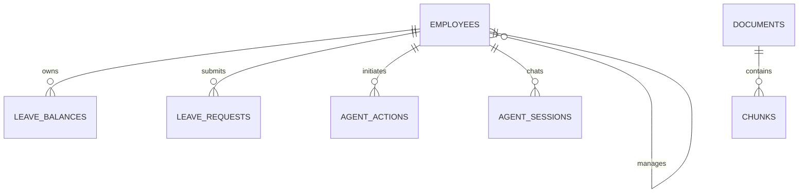

# 员工服务 Agent 数据模型方案

- 版本：v1.0
- 日期：2026-09-10
- 状态：持久化、迁移、导入、审批、登录身份、操作审计和演示数据重置均已实施
- 目标：把 `interview_data` 中的数据安全、可审计地映射到现有项目

## 1. 设计目标

本方案解决四个问题：

1. 哪些数据进入结构化数据库，哪些进入 RAG 知识库。
2. 现有模型需要增加哪些字段和表。
3. 待确认动作如何持久化，避免服务重启后丢失。
4. 请假申请如何按照固定状态流转。

## 2. 数据职责划分

| 数据 | 存放位置 | 是否参与 RAG | 说明 |
| --- | --- | --- | --- |
| 制度原文 | `documents`、`chunks` | 是 | 提供解释与引用 |
| 员工和主管 | `employees` | 否 | 身份与权限来源 |
| 年假余额 | `leave_balances` | 否 | 精确业务数据 |
| 请假申请 | `leave_requests` | 否 | 过程与状态数据 |
| 审批规则 | 后端规则服务 | 否 | 确定性执行 |
| 待确认动作 | `agent_actions` | 否 | 写操作审计与恢复 |
| 会话记录 | `agent_sessions` | 否 | 多轮上下文 |

核心原则：制度和业务状态分开存放，RAG 只解释规则，不承担精确业务计算。

## 3. 目标数据关系



说明：

- `EMPLOYEES` 内部通过 `manager_id` 和 `department_head_id` 建立上下级关系。
- `LEAVE_REQUESTS.approver_id` 指向员工编号。
- `AGENT_ACTIONS` 表示尚未确认或已处理的写操作。
- RAG 的 `DOCUMENTS` 与 `CHUNKS` 保持现有结构，不承载员工业务状态。

## 4. 员工表映射

源文件：`employees.json`

目标表：`employees`

| 源字段 | 目标字段 | 操作 |
| --- | --- | --- |
| `employee_id` | `employee_id` | 保留 |
| `name` | `name` | 保留 |
| `department` | `department` | 保留 |
| `position` | `position` | 保留 |
| `work_years` | `work_years` | 保留 |
| `role` | `role` | 保留，允许 `employee`、`manager` 和 `admin` |
| `manager_id` | `manager_id` | 新增，指向员工编号 |
| `department_head_id` | `department_head_id` | 新增，指向员工编号 |

约束：

- `employee_id` 唯一且非空。
- 普通员工必须有 `manager_id`。
- 所有主管和部门负责人必须存在且角色正确。
- 普通员工、直属主管、部门负责人应属于同一部门；管理层可由总经理跨部门审批。
- 不允许出现上下级循环。

## 5. 年假余额表映射

源文件：`leave_balances.json`

目标表：`leave_balances`

| 源字段 | 目标字段 | 操作 |
| --- | --- | --- |
| `employee_id` | `employee_id` | 外键映射到员工记录 |
| `year` | `year` | 保留 |
| `leave_type` | `leave_type` | 保留 |
| `total_days` | `total_days` | 保留 |
| `used_days` | `used_days` | 保留 |
| `remaining_days` | 不落库 | 查询时计算 |

唯一约束：

- `employee_id + year + leave_type` 必须唯一。

业务约束：

- `0 <= used_days <= total_days`。
- 剩余天数由后端计算，不接受前端或模型传入。
- 待审批申请不预扣余额。
- 主管批准时重新校验余额并更新 `used_days`。

## 6. 请假申请表映射

源文件：`leave_requests.json`

目标表：`leave_requests`

| 源字段 | 目标字段 | 操作 |
| --- | --- | --- |
| `request_id` | `request_id` | 保留，唯一 |
| `employee_id` | `employee_id` | 外键映射到员工记录 |
| `leave_type` | `leave_type` | 保留 |
| `start_date` | `start_date` | 保留 |
| `end_date` | `end_date` | 保留 |
| `days` | `days` | 保留 |
| `reason` | `reason` | 保留 |
| `status` | `status` | 保留，限制枚举 |
| `approver_id` | `approver_id` | 新增，指向审批人 |
| `submitted_at` | `submitted_at` | 新增 |
| `approved_at` | `approved_at` | 新增 |
| `rejected_at` | `rejected_at` | 新增 |
| `reject_reason` | `reject_reason` | 新增 |
| `cancelled_at` | `cancelled_at` | 新增 |

正式申请状态：

- `待审批`
- `已批准`
- `已拒绝`
- `已取消`

`待确认` 不属于本表状态。

## 7. 待确认动作表设计

新增表：`agent_actions`

| 字段 | 说明 |
| --- | --- |
| `action_id` | 动作唯一编号 |
| `session_id` | 发起动作的 Agent 会话 |
| `employee_id` | 发起人 |
| `tool_name` | 工具名，例如 `submit_leave_request` |
| `payload_json` | 待执行的完整参数 |
| `status` | 待确认、已确认、已取消、已过期、执行失败 |
| `created_at` | 创建时间 |
| `expires_at` | 过期时间 |
| `confirmed_at` | 确认时间 |
| `cancelled_at` | 取消时间 |
| `executed_at` | 执行完成时间 |
| `result_json` | 执行结果 |
| `error_message` | 失败原因 |

待确认动作状态流转：

```text
待确认
  ├─ 确认 → 已确认 → 执行成功
  ├─ 确认 → 已确认 → 执行失败
  ├─ 取消 → 已取消
  └─ 超时 → 已过期
```

约束：

- `action_id` 唯一。
- 只有 `待确认` 状态允许确认或取消。
- 确认操作必须幂等，重复确认不能创建重复请假单。
- 已过期动作不能执行。
- 执行失败必须保留错误原因。

## 8. 请假状态流转

```text
用户发起申请
    ↓
生成待确认动作，不写 leave_requests
    ↓
用户确认
    ↓
创建请假单：待审批
    ├─ 主管批准 → 已批准
    ├─ 主管拒绝 → 已拒绝
    └─ 员工或主管取消 → 已取消
```

规则：

- 待审批不扣减余额。
- 批准时更新余额。
- 拒绝和取消不更新余额。
- 每个状态变化记录操作人和时间。
- 已批准或已拒绝的申请不能再次审批。

## 9. 审批规则的位置

当前版本不单独建审批规则表，审批逻辑放在后端确定性规则服务中。

原因：

- 规则数量少且稳定。
- 便于测试和代码审查。
- 避免把审批逻辑同时维护在数据库、配置和文档三处。

制度文档仍保留在 RAG 中，用于解释规则来源。

如果后续规则数量明显增加，再迁移为可配置规则表。

## 10. JSON 导入顺序

正式导入时必须按以下顺序执行：

1. 导入 `employees.json`。
2. 校验员工、主管和部门负责人引用。
3. 导入 `leave_balances.json`。
4. 校验唯一性和余额公式。
5. 导入 `leave_requests.json`。
6. 校验申请人、审批人、状态和审批规则。
7. 记录导入结果和失败行。

原因：请假单依赖员工，员工依赖主管；如果先导入申请单，会产生无法解释的孤立数据。

## 11. 当前模型需要调整的部分

| 当前情况 | 目标调整 |
| --- | --- |
| `employees` 没有主管字段 | 增加 `manager_id`、`department_head_id` |
| `leave_requests` 没有审批人 | 增加 `approver_id` |
| 申请单没有完整审批时间 | 增加提交、批准、拒绝、取消时间 |
| 待确认动作只在内存 | 新增 `agent_actions` 持久化表 |
| 状态只是普通字符串 | 后端统一使用固定状态枚举 |
| 余额可直接查询 | 剩余天数统一由后端计算 |

## 12. 实施完成标准

1. JSON 中的每个业务字段都有明确目标位置。
2. 所有外键和业务引用都能校验。
3. 待确认动作在服务重启后仍可查询。
4. 重复确认不会重复创建申请。
5. 审批状态只能按合法路径变化。
6. 余额不足时无法创建正式申请。
7. RAG 文档与结构化业务数据完全分离。
8. 原有 RAG 和 35 个测试继续通过。
